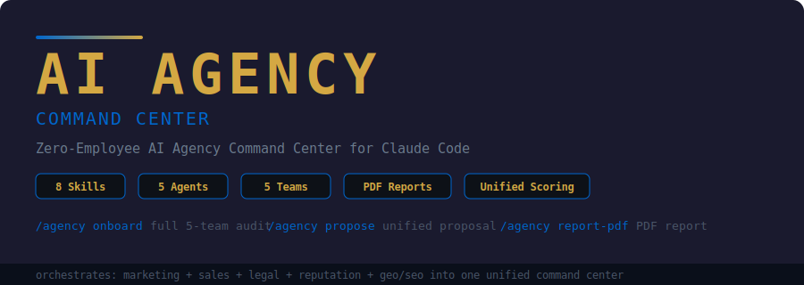

<p align="center">
  
</p>

<p align="center">
  <a href="#installation"></a>
  <a href="https://github.com/zubair-trabzada/ai-agency-claude/blob/main/LICENSE"></a>
  
  
  
  
  
</p>

---

## One-Command Install

```bash
curl -fsSL https://raw.githubusercontent.com/zubair-trabzada/ai-agency-claude/main/install.sh | bash
```

---

## What Is This?

The AI Agency Command Center is an **orchestration layer** that sits on top of 5 specialized AI tool suites for [Claude Code](https://docs.anthropic.com/en/docs/claude-code). It coordinates Marketing, Sales, Legal, Reputation, and GEO/SEO analysis into a single unified command — letting you run a full-service AI agency from your terminal with zero employees.

Type one command. Five parallel AI agents audit a business simultaneously. You get a unified score, prioritized findings, and a client-ready proposal with pricing tiers.

**Built for agency owners, freelancers, and consultants who want to sell AI-powered services to real businesses.**

```
> /agency onboard https://example-business.com

Phase 1 — Discovery...
Phase 2 — Launching 5 parallel audit teams...
  ✓ Marketing Agent       — Score: 62/100
  ✓ Reputation Agent      — Score: 45/100
  ✓ GEO/SEO Agent         — Score: 71/100
  ✓ Legal Compliance Agent — Score: 38/100
  ✓ Sales Intelligence Agent — Score: 78/100

Agency Composite Score: 59/100 (Grade: B)

Full report saved to AGENCY-ONBOARD-ExampleBusiness.md
```

---

## Architecture

```
                          /agency onboard <url>
                                  │
                        ┌─────────┴─────────┐
                        │   DISCOVERY PHASE  │
                        │  Fetch + Extract   │
                        └─────────┬─────────┘
                                  │
              ┌───────────┬───────┼───────┬───────────┐
              ▼           ▼       ▼       ▼           ▼
        ┌──────────┐ ┌────────┐ ┌─────┐ ┌─────┐ ┌────────┐
        │MARKETING │ │  SALES │ │LEGAL│ │REPU-│ │GEO/SEO │
        │  AGENT   │ │ AGENT  │ │AGENT│ │TATION│ │ AGENT  │
        │  (25%)   │ │ (20%)  │ │(15%)│ │(20%) │ │ (20%)  │
        └────┬─────┘ └───┬────┘ └──┬──┘ └──┬───┘ └───┬────┘
             │           │        │       │          │
             └───────────┴────┬───┴───────┴──────────┘
                              ▼
                    ┌─────────────────────┐
                    │  SYNTHESIS ENGINE   │
                    │  Composite Score    │
                    │  Unified Report     │
                    │  Service Proposal   │
                    └─────────────────────┘
                              │
              ┌───────────────┼───────────────┐
              ▼               ▼               ▼
        AGENCY-ONBOARD.md  AGENCY-PROPOSAL.md  AGENCY-REPORT.pdf
```

---

## Commands

| Command | Description | Output |
|---------|-------------|--------|
| `/agency onboard <url>` | Full agency onboard — runs ALL 5 audit teams in parallel | `AGENCY-ONBOARD-[Company].md` |
| `/agency quick <url>` | 60-second agency snapshot across all dimensions | Terminal output |
| `/agency propose <business>` | Generate unified agency proposal from all audit data | `AGENCY-PROPOSAL-[Client].md` |
| `/agency pipeline` | Show full prospect pipeline with composite scores | `AGENCY-PIPELINE.md` |
| `/agency client <name>` | Pull up all existing work for a specific client | Terminal output |
| `/agency status` | Dashboard view of all active clients and pending work | Terminal output |
| `/agency report-pdf` | Generate unified PDF combining all audit scores | `AGENCY-REPORT.pdf` |
| `/agency stack` | Show which tool suites are installed and ready | Terminal output |

---

## The 5 Tool Suites

The Agency Command Center orchestrates these 5 independent tool suites. Each can be installed and used on its own, but the Command Center coordinates them into unified deliverables.

| Suite | Skills | What It Covers | Repo |
|-------|--------|---------------|------|
| **AI Marketing Suite** | 15 skills | Copy, SEO, funnels, ads, email, conversion | [ai-marketing-claude](https://github.com/zubair-trabzada/ai-marketing-claude) |
| **AI Sales Team** | 14 skills | Company research, decision makers, proposals, outreach | [ai-sales-team-claude](https://github.com/zubair-trabzada/ai-sales-team-claude) |
| **AI Legal Assistant** | 14 skills | Contracts, compliance, GDPR, CCPA, ADA, privacy | [ai-legal-claude](https://github.com/zubair-trabzada/ai-legal-claude) |
| **AI Reputation Manager** | 14 skills | Reviews, sentiment, competitors, crisis response | Private — [AI Workshop](https://skool.com/aiworkshop) |
| **GEO/SEO Audit Tool** | 11 skills | AI search visibility, citability, schema, crawlers | [geo-seo-claude](https://github.com/zubair-trabzada/geo-seo-claude) |

---

## Scoring Methodology

The Agency Composite Score combines weighted scores from all 5 audit dimensions:

```
Agency Score = (Marketing x 0.25) + (Reputation x 0.20) + (GEO/SEO x 0.20)
             + (Legal x 0.15) + (Sales x 0.20)
```

Each dimension scores 0-100 based on its own audit criteria. The composite produces a unified grade:

### Grade Interpretation

| Score | Grade | Interpretation |
|-------|-------|----------------|
| 85-100 | **A+** | Excellent — minor optimizations only |
| 70-84 | **A** | Strong — some areas need attention |
| 55-69 | **B** | Average — significant improvement opportunities |
| 40-54 | **C** | Below Average — multiple critical issues |
| 25-39 | **D** | Poor — urgent intervention needed |
| 0-24 | **F** | Critical — fundamental problems across the board |

**Sweet spot for new clients:** Businesses scoring 30-60 (grades C-D) have the most pain and the highest willingness to pay for help.

---

## Service Tier Pricing

The `/agency propose` command generates three-tier proposals automatically:

| Tier | Monthly Price | What's Included |
|------|--------------|-----------------|
| **Essentials** | $500 - $1,500 | Critical fixes, monthly monitoring, basic reputation management |
| **Growth** | $1,500 - $3,500 | Full marketing optimization, GEO/SEO, active reputation management, monthly strategy calls |
| **Full Agency** | $3,500 - $7,500 | Complete overhaul across all dimensions, content creation, legal compliance, sales outreach, quarterly reviews |

---

## Use Cases

### Agency Owners
Run multi-dimensional audits on prospects in minutes instead of days. Deliver unified reports that justify premium retainers. Manage your entire pipeline from one interface.

### Freelancers
Expand your service offering from one specialty to five without hiring. Use audit data to upsell clients into higher-tier packages. Generate professional proposals that close.

### Consultants
Back your recommendations with data from 5 parallel analysis streams. Produce client-ready PDF reports with composite scoring. Track all prospect and client work in one place.

---

## Installation

### Prerequisites

- [Claude Code](https://docs.anthropic.com/en/docs/claude-code) installed and configured
- Python 3.8+ (for PDF report generation)
- `reportlab` Python package (`pip install reportlab`)

### Quick Install

```bash
curl -fsSL https://raw.githubusercontent.com/zubair-trabzada/ai-agency-claude/main/install.sh | bash
```

### Manual Install

```bash
git clone https://github.com/zubair-trabzada/ai-agency-claude.git
cd ai-agency-claude
chmod +x install.sh
./install.sh
```

### Install Tool Suites

The Command Center works best with all 5 tool suites installed. Install them individually:

```bash
# AI Marketing Suite
curl -fsSL https://raw.githubusercontent.com/zubair-trabzada/ai-marketing-claude/main/install.sh | bash

# AI Sales Team
curl -fsSL https://raw.githubusercontent.com/zubair-trabzada/ai-sales-team-claude/main/install.sh | bash

# AI Legal Assistant
curl -fsSL https://raw.githubusercontent.com/zubair-trabzada/ai-legal-claude/main/install.sh | bash

# GEO/SEO Audit Tool
curl -fsSL https://raw.githubusercontent.com/zubair-trabzada/geo-seo-claude/main/install.sh | bash
```

> **AI Reputation Manager** is available exclusively in the [AI Workshop community](https://skool.com/aiworkshop).

### PDF Report Support

```bash
pip install reportlab
```

### Uninstall

```bash
# From the cloned repo directory:
chmod +x uninstall.sh
./uninstall.sh
```

### Check Your Stack

After installing, run `/agency stack` in Claude Code to see which suites are ready.

---

## License

MIT License. See [LICENSE](LICENSE) for details.

---

<p align="center">
  <b>Learn How to Sell Claude Code Services to Real Businesses</b>
  <br><br>
  <a href="https://skool.com/aiworkshop">
    
  </a>
  <br><br>
  Get the AI Reputation Manager, step-by-step setup guides, sales playbooks, and the full agency system.
  <br>
  <a href="https://skool.com/aiworkshop">https://skool.com/aiworkshop</a>
</p>
